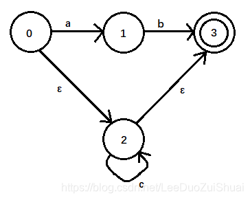
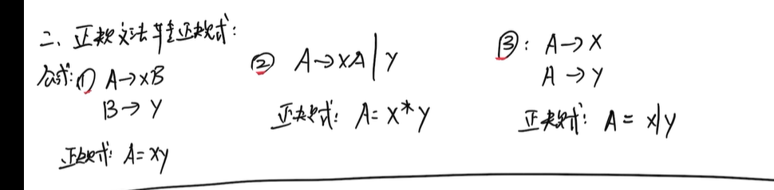

# 编译原理课程考前学习

## 编译原理学习时长记录

1. 11月28日 10：00-12：00（近2h）阅读博客(`http://t.csdnimg.cn/OClo3`),进度：**博客阅读到3.2**
2. 11月28日 13：00-14：00 （近1h）阅读博客(`http://t.csdnimg.cn/OClo3`),进度：**博客阅读到4.2**
2. 11月28日 15：05-15：35 （近1h）阅读博客(`http://t.csdnimg.cn/OClo3`),进度：**博客阅读完了第四章**
2. 11月29日 9：50-11：55 （近2h） 看速成课，进度：p1-p7
2. 11月29日 13：00-16：00（近3h）看速成课，进度：p8-p11
2. 11月30日 10：15-11：45 （近1.5h）看速成课，进度：p12-p15（看完）
2. 12月3日 20：00-20：45 （40min）看对分易作业
2. 12月4日 15：00-17：00（近2h）看编译原理考试题型

## 11月28日

## 第一章 编译原理基本概念

### 一.翻译程序的三种方式

1. **编译**：将高级语言编写的源程序翻译成等价的机器语言或汇编语言（高级语言编写的源程序=>机器语言或汇编语言）
2. **解释**：将高级语言编写的源程序翻译一句执行一句，不生成目标文件，直接执行源代码文件（一遍翻译一边执行用高级语言编写的源代码文件）
3. **汇编**：用汇编语言编写的源程序翻译成与之等价的机器语言（汇编语言编写的源程序=>机器语言）

二.编译程序的五个阶段
1.**词法分析**：对源程序的字符串进行扫描和分解，识别出每个单词符号。（字符串=>单词符号）
2.**语法分析**：根据语言的语法规则，把单词符号分解成各类语法单位。（单词符号=>语法单位）
3.**语义分析与中间代码生成**：对各种语法范畴进行静态语义检查，若正确则进行中间代码翻译。（语法单位=>中间代码）
4.**代码优化**：遵循程序的等价变换规则。（中间代码优化）
5.**目标代码生成**：将中间代码变换成特定机器上的低级语言代码。（中间代码=>机器语言代码）

## 第二章 文法与语言

### 2.1 符号串和语言

#### 2.1.1 字母表

1.**定义**：字母表是有穷非空的符号集合。(符号集合)
2.**表示**：通常用字母表大写字母A，B，…Z和希腊字母Σ表示。
**eg**：A={0,1}，Σ={a,b,c,d}
3.**说明**
**1**）字母表包含了语言中所允许出现的一切符号。
**2**）字母表中的符号也称**字符**。

#### 2.1.2 符号串

1.**定义**：由字母表中的**符号组成的有穷序列**。
2.**表示**：通常由t，u，v，w，x，y，z等小写英文字母来表示。
3.**说明**
  **1**）符号串由构成的符号的种类、数量、顺序共同决定。
  **2**）不包含任何符号的符号串称为空符号串，简称**空串**，用**ε**表示。

4.**对于给定的字母表Σ，符号串的递归定义如下**：
  **1**）ε是Σ上的一个符号串。
  **2**）若x是Σ上的符号串，a是Σ的符号，则xa是Σ上的符号串。并规定εa=a，aε=a。
  **3**）y是Σ上的符号串，当且仅当y由1）和2）导出。

**注**：符号串的递归定义用于证明，理解证明背后的逻辑

5.**子符号串**：一个非空符号串中若干连续符号组成的部分。
6.**字符串的前缀和后缀**
  若z=abd是字母表Σ={a,b,c,d}上的符号串，则ε，a，ab，abd都是z的前缀；ε，d，bd，abd都是z的后缀。

7.**符号串之间的运算**
  **1）连接**：符号串x，y的连接xy就是把符号串y写在x后面得到的字符串。
    **eg**：若x=ab，y=cd，则xy=abcd，yx=cdab。
  **2）方幂**：若x是符号串，xn表示n个按顺序连接。当n=0时，x0是空符号串ε。

#### 2.1.3 语言

1.**定义**：由字母表上的一些符号串组成的集合。

**注**：**字符**组成**符号串**，符号串组成**语言**

2.**说明**
  空集Ø是一个语言，仅含一个空符号串的集合{ε}也是一个语言。Ø和{ε}是不同的语言。

3.符号串集合之间的运算
    1）并集
        设A和B是符号串的集合，则A和B的并集定义为
        A∪B = {x | x∈A or x∈B}。
    2）乘积
        设A和B是符号串的集合，则A和B的乘积定义为
        AB = {xy | x∈A and y∈B}。
        eg：若A={a,b}，B={b,c}，则AB = {ab,ac,bb,bc}。
        对任意符号串集合A，有{ε}A = A{ε} = A。
3）**幂运算**
        设A是符号串的集合，则A的幂运算定义为
        A0 = {ε}
        A1 = A
        An = AAn-1（n>0）
        eg：若A={0,1}，则A0={ε}，A1={0,1}，A2={00,01,10,11}。
    4）**正闭包与闭包**
        设A是符号串的集合，则集合A的正闭包A+和闭包A*定义为
        A+ = A1∪A2∪…∪An∪…
        A* = A0∪A1∪…∪An∪…
        eg：若A={0,1}，则A+={0,1,00,01,10,11,000,001,…}，A*={ε,0,1,00,01,10,11,000,001,…}。

### 2.2 文法和语言的形式化定义
#### 2.2.1 文法的形式化定义
##### 1.产生式规则
​    1）定义：一个产生式规则是一个有序对(A，α)。通常写作A→α或A::=α。
​        ”**→**"或”::=”表示“**定义为**”、“由…组成”、“**生成**”。
​    2）含义： A→α表示左部符号A生成右部符号串α。
​    3）若A→α；A→β，则可以写成A→α|β。”|”表示“或”。
​    4）非终结符号：产生式规则左部出现的符号。
​    5）终结符号：不是非终结符号的符号。
​    6）非终结符号既可以出现在产生式规则的左部，也可以出现在产生式规则的右部。终结符号不能出现在产生式规则的左部。
​    7）非终结符号通常用大写字母或尖括号括起来的部分表示。

##### 2.文法
​    1）定义：产生式规则的非空有穷集合。由四元组G=(VN，VT，P，Z)组成。（**产生式规则集**）
​    2）**VN**：是一个非空有穷集合。它的每个元素称为**非终结符号**。且VN∩VT=Ø。（**非终结符号集**）
​    3）VT：是一个非空有穷集合。它的每个元素称为**终结符号**。（**终结符号集**）
​    4）P：是文法规则(产生式规则)的非空有穷集合，每个产生式规则的形式是A→α或A::=α，其中A∈VN，α∈(VN∪VT)*。（**文法规则集**）
​    5）Z：是一个非终结符号。称为开始符号或识别符号。它至少要在一条产生式规则的左部出现。有它开始识别定义的语言。（**开始符号**）
​    6）通常不必将文法的四元组显式地表示出来，而仅需给出文法的产生式规则集。
​    7）**对于两个不同的文法G[Z]和G’[E]，若这两个文法生成的语言相同，则称这两个文法是等价的。**（用于文法等价证明）

#### 2.2.2 语言的形式化定义

##### 1.直接推导与推导
​    1）直接推导：令G=(VN，VT，P，Z)，若A→γ∈P，且α,β∈(VN∪VT)*，则称αAβ直接推导出αγβ，表示成αA ⇒ βαγβ。
​    2）推导：若存在一个直接推导序列：α0⇒α1⇒α2⇒…⇒αn，则称这个序列是一个从α0至αn的长度为n的推导。
​        当n>0时，α0至αn的推导记为α0 ⇒+ αn，表示从α0出发，经过1步或者若干步可推导出αn。
​        当n≥0时，α0至αn的推导记为α0 ⇒* * αn，表示从α0出发，经过0步或者若干步可推导出αn。

##### 2.**句型和句子**
设有文法G[Z]，Z是文法G的开始符号。
  **1）句型**：若Z ⇒* x，x∈(VN∪VT)*，则称符号串x为文法G[Z]的句型。
  **2）句子**：若Z ⇒* x，x∈VT*，则称符号串x为文法G[Z]的句子。（VT：终结符号集）
  **3**）句子一定是句型，句型不一定是句子。

##### 3.语言
​    1）定义：文法G[Z]产生的所有句子的集合称为文法G所定义的语言，记为L(G[Z])，简写为L(G)。L(G)={x| Z ⇒+ x且x∈VT*}。
​    2）语言L(G)是VT*的子集。
​    3）L(G)中的每一个符号串均由终结符号组成，且该符号串能由开始符号Z推导出来。

##### 4.**递归规则(直接递归)**
  **1）定义**：一个产生式规则中，出现在左部的非终结符也出现在其右部。
  **2）种类**：左递归、右递归、递归。
  **3）左递归**：A→A…
  **4）右递归**：A→…A
  **5）递归**：A→…A…

##### 5.文法递归
​    1）定义：对于文法中的任一非终结符，若能建立一个推导过程，在推导所得的符号串中又出现该终结符本身，则称文法是递归的。
​    2）种类：左递归、右递归、递归。
​    3）左递归：A ⇒+ A…
​    4）右递归：A ⇒+ …A
​    5）递归：A ⇒+ …A…

#### 2.2.3 短语、直接短语、句柄
设G[Z]是一个文法，假定αβδ是文法G的一个句型。
    1）短语：若存在Z ⇒+ αAδ且A ⇒+ β，则称β是句型αβδ相对于非终结符A的短语。
    2）直接短语：若存在Z ⇒+ αAδ且A⇒β，则称β是句型αβδ相对于产生式规则A→β的直接短语。
    3）句柄：一个句型的最左直接短语称为该句型的句柄。

#### 2.2.4 规范推导和规范归约
1.最左推导：对一个推导序列中的每一步直接推导α⇒β，都是对α中的最左非终结符进行替换。
2.最右推导(规范推导)：对一个推导序列中的每一步直接推导α⇒β，都是对α中的最右非终结符进行替换。
3.规范句型：由规范推导得到的句型。
4.最左归约(规范归约)：规范推导的逆过程。

### 2.3 语法分析树与文法的二义性

#### 2.3.1 语法分析树
1.语法分析树：一个句型推导过程的树形表示称为语法分析树，简称语法树。
2.满足条件：设G=(VN，VT，P，Z)是一个上下文无关文法。
    1）根节点的标记为Z。
    2）根节点外的每个节点也有一个标记，它是VN∪VT∪{ε}中的符号。
    3）每一个内部节点的标记A必在VN中。
    4）若某个内部节点标记为A，其孩子节点的标记从左到右分别为X1，X2，…，Xn，则A→X1X2…Xn必为P中的一条产生式规则。
    5）若节点有标记ε，则该节点为叶子，且是它父亲唯一的孩子。

3.构造步骤：已知文法G[Z]，对于w，若Z ⇒* w，则
    1）以开始符号Z为标记的根节点。
    2）对每一步推导，根据使用的产生式规则生成一颗子树，直到所有叶子节点从左到右的标记符号连接为w为止。
        若产生式规则为A→X1X2…Xn，则生成以A为根节点的子树，其孩子节点从左到右分别为X1，X2，…，Xn。
        eg：设文法G[E]：
        E→E+T|E-T|T
        T→T*F|T/F|F
        F→(E)|i
        推导句型T+i*(F-i)的语法树。

#### 2.3.2 文法的二义性

1.**定义**：若一个文法存在某个句子对应两棵不同的语法树，则称这个文法是二义的。
2.**特点**：为编译程序的执行带来不确定性。

#### 2.3.4 二义性的消除

1.**不改变文法**：通过附加限制性条件消除二义性。
寻找充分不必要条件，当文法满足这些条件时可确保文法是无二义性的。
2.**改变文法**：改写原有文法，把排除二义性的规则合并到原文法消除二义性。

### 2.4 文法的化简

1.若一个非终结符不能推导出终结字符串，则该非终结符是无用的，删除所有包括该非终结符的产生式规则。
2.若一个符号不能出现在文法的任何句型中，则该符号是无用的，删除所有包括该符号的产生式规则。

### 2.5 语言的分类
1.0型文法(短语文法)
    1）定义：若文法G[Z]=(VN，VT，P，Z)中的每个产生式规则的形式为：α→β，其中α∈(VN∪VT)*且至少含有一个非终结符号，而β∈(VN∪VT)*，则G[Z]为0型文法。（**产生式中至少含有一个非终结符**）
    2）特点：0型文法的能力相当于图灵机，识别能力最强。
2.1型文法(上下文敏感文法)
    1）定义：若文法G[Z]=(VN，VT，P，Z)中的每个产生式规则的形式为：αAβ→αvβ，其中α,β∈(VN∪VT)*，A∈VN，v∈(VN∪VT)+，则G[Z]为1型文法。（**每个产生式都有一个非终结符**）
3.2型文法(上下文无关文法)
    1）定义：若文法G[Z]=(VN，VT，P，Z)中的每个产生式规则的形式为：A→v，其中A∈VN，v∈(VN∪VT)*，则G[Z]为2型文法。
    2）特点：语法结构上下文无关，一般用于识别程序设计语言的语法结构。
4.3型语言(正规文法)
    1）种类：右线性文法、左线性文法
    2）右线性文法：若文法G[Z]=(VN，VT，P，Z)中的每个产生式规则的形式为：A→αB或A→α，其中A,B∈VN，α∈(VN∪VT)*，则G[Z]为右线性文法。
    3）左线性文法：若文法G[Z]=(VN，VT，P，Z)中的每个产生式规则的形式为：A→Bα或A→α，其中A,B∈VN，α∈(VN∪VT)*，则G[Z]为左线性文法。
    4）特点：作为定义程序设计语言规则的文法
    5）正规语言：3型文法定义的语言。

## 第三章 词法分析与有限自动机

### 3.1 词法分析器的设计
#### 3.1.1 词法分析器的任务
1.功能：输入源程序，输出单词符号。

#### 3.1.2 词法分析器的输出格式
单词是程序的基本语言单位。
通常，输出的单词符号表示成二元式：(单词种类，单词符号的属性值)。
单词种类：关于单词种类的整数编码。
单词符号的属性值：反应单词符号特性或特征的值。

1.单词的种类
    1）关键字：eg：while、if、else
    2）标识符：eg：变量名、数组名、函数名…
    3）常数：eg：80、1.23、“Hello“…
    4）运算符：eg：算术运算符、逻辑运算符、关系运算符…
    5）界限符：eg：,、:、[、]、{、}…
除了五类单词，还包括空格符、回车符、换行符等。

### 3.2 词法分析器的手工构造
#### 3.2.1 确定的有限自动机
1.定义：一个确定的有限自动机(DFA) M是一个五元组：M=(S，Σ，δ，s0，F)，其中：
    1）S是一个有限集，它的每一个元素称为一个状态。（**状态集**）
    2）Σ是一个有穷字母表，它的每个元素称为一个输入字符。（**字符集**）
    3）δ是一个从S×Σ到S的单值部分映射。δ(s，a)=s’表示在目前状态s下输入字符为a时，将转换到下一个状态s’。s’被称为s的一个后继状态。（**映射集**）
    4）s0∈S，s0是唯一的初态。（**初态**）
    5）F ⊆S，F是一个终态集，可以为空。（**终态集**）

2.**DFA的状态转移矩阵**
  DFA可用一个二维矩阵表示，矩阵的行表示状态，列表示输入字符，矩阵元素表示δ(s，a)的值。

3.**DFA的状态转换图**
  若设DFA M含有m个状态和n个输入字符，则这个图含有m个状态结点，每个结点至多有n条箭弧射出与其它的状态结点相连接，每个箭弧用Σ中的一个不同输入字符作为标记。整张图含有唯一的初态结点和若干终态结点。

4.DFA识别字符串
    1）对Σ上的任何符号串w∈Σ*，若存在一条从初态结点到某一终态结点的通路，且该通路上所有弧的标记符连接成的字符串等于w，则称w可被DFA M所识别。若M的初态结点同时又是终态结点，则空字符串ε被M所识别。
    2）DFA与语言的关系：DFA M所能识别的符号串的全体记为L(M)。
    eg：设DFA M=({0,1,2,3}，{a,b}，δ，{3})，其中，δ定义为：
        δ(0，a)=1，δ(0，b)=2，δ(1，a)=3，δ(1，b)=2，δ(2，a)=1，δ(2，b)=3，δ(3，a)=3，δ(3，b)=3。

5. **δ的递归扩展定义**
     对一个DFA M，其识别的语言L(M)={w|w∈Σ*，若存在Z∈F，使δ(s0，w)=Z}，其中：w=ua∈Σ*，则δ(s，ε)=s，δ(s，ua)= δ(δ(s，u)，a)。（暂时略过）

### 3.3 有限自动机及其化简

  有限自动机包括确定有限自动机和不确定有限自动机。

#### 3.3.1 不确定有限自动机
1.定义：一个不确定有限自动机(NFA) M是一个五元组：M=(S，Σ，δ，S0，F)，其中：
    1）S是一个有限集，它的每一个元素称为一个状态。
    2）Σ是一个有穷字母表，它的每个元素称为一个输入字符。
    3）δ是一个从S×Σ到S的子集的映射，即δ：S×Σ*→2S
    4）S0⊆S，S0是一个非空初态集。
    5）F ⊆S，F是一个终态集，可以为空。

2.NFA的状态转换图
    若设NFA M含有n个状态和m个输入符号，则这个图含有n个状态结点，每个结点可射出若干箭弧与其它的状态结点相连接。对于w∈{ε}∪Σ，若δ(q0，a)={q1，q2，…，qk}(k≥0)，则从q0出发，分别到q1，q2，…，qk的k条弧，弧上均标记为a。整张图含有唯一的初态结点和若干终态结点。
3.NFA识别字符串
    1）对Σ*上的任何符号串，若存在一条从某一初态结点到某一终态结点的通路，且该通路上所有弧的标记符号依次连接成的字符串等于w，则称w可被NFA M所识别。若M的某些结点同时又是终态结点，则空字符串ε被M所识别。
    2）NFA与语言的关系：Σ*中所有可被NFA M所识别的符号串的集合记为L(M)。
4.DFA和NFA的关系
    1）DFA是NFA的特例，NFA是DFA概念的推广。
    2）NFA能识别的语言都能被一个DFA识别。
    3）DFA相对NFA的识别程序更容易实现。
#### 3.3.2 不确定有限自动机的化简
1.NFA的确定化：对任给的NFA M。都能相应地构造一个DFA M‘，使得L(M’)=L(M)。
2.NFA的化简思路：DFA的每一个状态代表NFA状态集合的某个子集，构造的DFA使用它的状态去记录NFA读入输入符号之后可能到达的所有状态的集合。
3.闭包：若q为一初始状态s0，让a为ε，则δ(s0，a)={q1，q2，…，qk}为所有等价的状态结点构成的集合，这个集合被称为s0的ε闭包。记为ε-Closure(s0)。
4.推广：集合I的ε-Closure(I)
设I是NFA M的状态集的子集，定义I的ε闭包ε-Closure(I)：
    1）若q∈I，则q∈ε-Closure(I)。
    2）若q∈I，则从q出发经过任意条ε弧而能到达的任何状态q’，有q’∈ ε-Closure(I)。
    eg：将下图NFA M确定化。

 生成DFA M‘的初态ε-Closure({0})={0，2，3}。重新命名生成的各个状态：{0，2，3}为0，{1}为1，{2，3}为2，{3}为3。由于{0，2，3}、{2，3}和{3}中均包含M中的终态3，因此0、2、3为M’的终态。

#### 3.3.3 确定有限自动机的化简
1.化简的目的：去除多余或等价的状态，降低存储代价，提高句子识别的效率。
2.有限自动机的多余状态：从初态出发，任何可识别的输入串也不能到达的状态。
3.状态等价：设DFA M=(S，Σ，δ，s0，F)，对s,t∈S，若对任何α∈Σ*，均有δ(s，α)∈F当且仅当δ(t，α)∈F，则称状态s和t是等价的。若状态s和t是不等价的，则称状态s和t是可区别的。
4.DFA M的化简
    1）定义：对一个DFA M，若能找到一个状态比M少的DFA M’，使得L(M)=L(M’)，且M’满足两个条件：i）M’中没有多余的状态。ii）M’的状态集中，没有两个状态是互相等价的。则称DFA M‘是一个最小化的DFA。也称DFA M的化简。
    2）最小化的方法：把DFA M的状态Q划分成一些不相交的子集，使每个子集中任何两个状态是等价的，而任何两个属于不同子集的状态是可区别的。然后在每个子集中任取一个状态作为代表，删除子集中的其余状态，并把射向其余状态的箭弧都改为射向代表的状态。
    3）最小化的具体步骤：
        i）将DFA M的状态集S划分为两个子集；终态集F和非终态集F ̃，形成初始划分Π。
        ii）对Π建立新的划分Πnew。对Π中的每个状态子集G进行如下变换：
            a）把G划分成新的子集，使G的两个状态s和t属于同一个子集，当且仅当对任何输入符号a，状态s和t转换到的状态都属于Π的同一子集。
            b）用G划分出的所有新子集替换G，形成新的划分Πnew。
        iii）若Πnew和Π相等，则执行第iv）步，否则，令Π=Πnew，重复第ii）步。
        iv）划分结束后，对划分中的每个状态子集，选出一个状态作为代表，删去其它一切等价的状态，并把射向其它状态的箭弧改为射向这个代表的状态。
        eg：化简DFA。

根据终态和非终态划分为两个子集：Π1={A，B，F}，Π2={C，D，E，G}。
        对Π1，输入b，状态A、B经过b可到达终态，而F经过b不能到达终态。因此Π1划分为两个子集Π11={A，B}和Π12={F}。
        对Π11，输入bb，A经过bb可到达终态，而B不能，所以A和B是可区别的两个状态。
        故Π1划分为{A}、{B}、{F}三个子集。
        对Π2，输入b，划分成两个子集Π21={C，E}和Π¬22={D，G}。
        对Π21，输入a，划分成两个子集{C}和{E}。
        故Π2划分成{C}、{E}、{D，G}。
        最终状态集合划分成：{A}、{B}、{F}、{C}、{E}、{D，G}。

### 3.4 正规文法、正规式和自动机之间的关系
#### 3.4.1 正规式与正规集
1.定义：设字母表Σ：
    1）ε和Ø都是Σ上的一个正规式，它们所表示的正规集为{ε}和Ø。
    2）任何a∈Σ，a是Σ上的一个正规式，它所表示的正规集为{a}。
    3）假设e1和e2是Σ上的正规式，它们所表示的正规集分别为L(e1)和L(e2)，则
        i）e1|e2是Σ上的正规式，它所表示的正规集为L(e1|e2)= L(e1)∪L(e2)。
        ii）e1e2是Σ上的正规式，它所表示的正规集为L(e1e2)= L(e1)L(e2)。
        iii）(e1)*是Σ上的正规式，它所表示的正规集为L((e1)*)= L(e1)*。

2.正规式的运算
    1）种类：或”|”、连接”.”、闭包”*”。
    2）优先级：闭包>连接>或
    3）说明：仅由有限次使用这三种运算而得到的表达式才是Σ上的正规式。仅由这些正规式表示的单词集才是Σ上的正规式。
3.正规式的等价：若两个正规式U和V描述的正规集相同，则称正规式U和V等价。
4.正规式的性质：令U、V、W均为正规式：
    1）U|V=V|U
    2）U|(V|W)=(U|V)|W
    3）U(VW)=(UV)W
    4）U(V|W)=UV|UW
    5）(V|W)U=VU|WU
    6）εU=Uε=U
    eg：令Σ={a，b}，则有：
        1）正规式a|b表示的正规集为{a，b}。
        2）正规式(a|b)(a|b)表示的正规集为{aa，ab，ba，bb}。
        3）正规式a*表示的正规集为{ε，a，aa，aaa，…}。
        4）正规式(a|b)*表示的正规集为{ε，a，b，aa，ab，ba，bb，aaa，…}。
        5）正规式a|a*b表示的正规集为包含字符串a和包含0个或多个a后跟随一个b的所有的符号串。
#### 3.4.2 正规式与正规文法的关系
1.正规式转换为正规文法
字母表Σ上的正规式U到正规文法G[Z]=(VN，VT，P，Z)的转换方法为：
    1）令VT=Σ，将Z→U加入到P中。
    2）对P中的每条产生式规则V→U，若U=ε或U=a(a∈Σ)，则本次转换结束，否则按照如下规则反复执行，直到所有产生式规则最多含有一个终结符号为止：
        i）若U=e1|e2，则将V→U修改为V→A|B，A→e1，B→e2。
        ii）若U=e1e2，则将V→U修改为V→e1B，B→e2。
        iii）若U=(e1)*e2，则将V→U修改为V→e1V，V→e2。
2.正规文法转换为正规式
    1）将正规文法中的每个非终结符表示成它的一个正规式方程，获得一个联立方程组。
    2）若x=αx|β(或x=αx+β)，则解为x=α*β。
    3）若x=xα|β(或x=xα+β)，则解为x=βα*。

#### 3.4.3 正规文法与有限自动机之间的转换
1.右线性文法转换为有限自动机
设G[Z]=(VN，VT，P，Z)是一个右线性文法，其产生式规则具有形式A→aB|a|ε，由G构成相应的有限自动机M=(S，Σ，δ，s0，F)的步骤为：
    1）令s0={Z}，将每个非终结符看作M中的一个状态，并增加一个终态Y且Y∉VN，令F={Y}，即可得S=VN∪F。令Σ=VT。
    2）对G中每一形如A→ε的产生式规则，令δ(A，ε)=Y。
    3）对G中每一形如A→a的产生式规则，令δ(A，a)=Y。
    4）对G中每一形如A→aB的产生式规则，令δ(A，a)=B。
构造的M多数情况下为NFA。
2.左线性文法转换为有限自动机
设G[Z]=(VN，VT，P，Z)是一个左线性文法，其产生式规则具有形式A→Ba|a|ε，由G构成相应的有限自动机M=(S，Σ，δ，s0，F)的步骤为：
    1）令F={Z}，将每个非终结符看作M中的一个状态，并增加一个初态X且X∉VN，令s0={X}，即可得S=VN∪{X}。令Σ=VT。
    2）对G中每一形如A→ε的产生式规则，令δ(X，ε)=A。
    3）对G中每一形如A→a的产生式规则，令δ(X，a)=A。
    4）对G中每一形如A→Ba的产生式规则，令δ(B，a)=A。
构造的M多数情况下为NFA。
3.有限自动机转换为正规文法
对给定的有限自动机M=(S，Σ，δ，s0，F)，可构造相应的正规文法G[Z]=(VN，VT，P，Z)，使得L(G)=L(M)，构造方法的主要步骤如下：
    1）令VT=Σ，VN=S，Z=s0.
    2）若Z是一个终态，则将产生式规则Z→ε加到P中。
    3）对δ(A，a)=B，若B∉F，则将产生式规则A→aB加到P中。否则，将产生式规则A→aB|A→a或A→aB，B→ε加到P中。特别的，若δ(A，a)=A，则将A→aA|ε加到P中。

#### 3.4.4正规式与有限自动机之间的转换

1.**由正规式构造有限自动机**
设r是字母表Σ上的一个正规式，构造可识别语言L®的NFA M=(S，Σ，δ，s0，F)的方法如下：
  **1**）引入初始结点s0和终态结点Z，把r表示称广义转化图：

 **2**）若r=ε，或r=Ø，或r=a∈Σ，则构造相应的三个有限自动机：

否则，按照转换规则3）执行。
  **3**）针对r中的运算，按下图转换规则对r进行分裂并加进新结点(名字不同于已有的结点)，直到每条边上的标记为单个符号或ε为止。

**4**）令F={Z}，S为所有新增的结点。、初始结点s0、终态结点Z组成的集合。
2.**有限自动机构造正规式**
设有一个NFA M=(S，Σ，δ，s0，F)，构造可识别语言L®的正规式r的方法如下：

## 第四章 自顶向下的语法分析
### 4.1 语法分析器的功能
1.**功能**：以词法分析器生成的单词符号序列作为输入，在分析过程中验证这个单词符号序列是否是该程序设计语言的文法的一个句子。（检查单词符号序列是否为句子）

2.**语法分析方法的种类**：自顶向下和自底向上。

3.自顶向下的语法分析
    1）定义：从顶部(树根)建立语法分析树，构造一个最左推导，面对当前输入的单词符号和当前被替换的非终结符，选择这个非终结符的某个产生式规则进行替换。（从顶部开始分析，采用最左推导）
    2）分类：递归下降的预测分析法(递归下降预测法)、非递归的预测分析法(非递归预测法)(LL(1)分析法)。
    3）说明：若文法是二义的，则递归下降法和非递归预测法通常均可回溯。4.2 不确定的自顶向下的分析方法

### 4.2 不确定的自顶向下的分析方法

1.**基本思想**：对给定的单词符号串w，从文法的开始符号出发，试图构造一个最左推导，或自顶向下的为w建立一棵语法分析树。若成功的为w构造一个相应的推到序列或一棵语法分析树，则w为相应文法的合法句子，否则w不是文法句子。（检验w是否为文法句子）

2.**本质**：穷举试探，反复使用不同规则，寻求匹配输入串的过程。

3.具体过程：在每一步推导中，面对替换的非终结符A和从左到右读输入串读到的单词符号a，若A的产生式规则(除了A→ε)A→α1|α2|…αn中，只有αi(1≤i≤n)能推导出的第一个终结符号是a，则可选择A→αi构造最左推导。若A的产生式规则(除了A→ε)中，推导的首个符号集合不含a，则选择A→ε进行推导。其中，a称为向前看符号。
4.特点：效率低，回溯代价高，实际过程**通常不用**。（通常不用还看半天！！！菜菜菜！！！）

### 4.3 LL(1)分析方法
#### 4.3.1 回溯的判别条件与LL(1)文法
1.First集：设G[Z]=(VN，VT，P，Z)，α∈(VN∪VT)*，符号串α的首符号集合的定义为：
                     First(α)={a|α ⇒* a…且a∈VT}
若α ⇒* ε，则规定ε∈First(α)。
2.Follow集：设G[Z]=(VN，VT，P，Z)，A∈VN，非终结符号A的后继符号集合的定义为：
                     Follow(A)={a|Z ⇒* …Aa…且a∈VT}
若Z ⇒* …A，则规定#∈First(A)。#为结束符。
3.回溯的判断：对一个上下文无关文法G[Z]=(VN，VT，P，Z)，对某个产生式规则A→α1|α2|…αn，若存在a∈VT，使得a∈First(αi)∩First(αj)(1≤i,j≤n且i≠j)或a∈First(αi)∩Follow(A)(1≤i≤n，A ⇒* ε)或αi ⇒* ε且αj ⇒* ε(1≤i,j≤n且i≠j)，则对应于文法G的自顶向下分析需要回溯。
4.LL(1)文法定义
    1）文法不含左递归。
    2）对某个非终结符A，若其对应的产生式规则为A→α1|α2|…αn，则First(αi)∩First(αj)=Ø(1≤i,j≤n且i≠j)。
    3）对文法中的每个非终结符A，若A ⇒* ε，则First(αi)∩Follow(A)=Ø(1≤i≤n)。
#### 4.3.2 左递归文法的改造
1.左递归缺点：容易产生死循环
2.消除直接左递归
    若某个文法中非终结符A的产生式规则是直接左递归规则：A→Aα|β，其中α,β∈(VN∪VT)*。若β不以A打头，则将A的产生式规则改写为：A→βA’，A’→αA’|ε。A’是新增加的非中介符号。
    推广：若A的全部产生式规则为：A→Aα1| Aα2|…|Aαm|β1|β2|…|βn，其中βi(1≤i≤n)不以A开头，且αi(1≤i≤m)不等于ε，则A的产生式规则改写为：A→β1A’|β2A’|…|βnA’， A’→α1A’|α2A’|…αmA’|ε。
    eg：设有文法G[Z]：
        E→E+T|E-T|T
        T→T*F|T/F|F
        F→(E)|i
        消除非终结符E,T的直接左递归后，文法G[Z’]改写为：
        E→TE’
        E’→+TE’|-TE’|ε
        T→FT’
        T’→*FT’|/FT’|ε
        F→(E)|i

3.消除间接左递归
    1）对文法G的非终结符号按任一种顺序排列成A1，A2，…，An。
    2）依次对各非终结符号对应的产生式进行左递归的消除：
        for(j=1;j<=n;j++)
            for(k=1;k<=j-1;k++){
                 i)把每个形如Aj→Akα的规则改写为Aj→δ1α|δ2α|…|δmα。其中Ak→δ1|δ2|…|δm是关于当前Ak的产生式规则；
                 ii)消除关于产生式规则Aj的直接左递归；
            }
    3）进一步化简消除左递归之后的新文法，删去多余的产生式规则。
    eg：设有文法G[S]：
        S→Sa|Tbc|Td
        T→Se|gh
        将非终结符号排成顺序为S，T
        消除产生式S左递归：
        S→(Tbc|Td)S1
        S1→aS1|ε
        对T→Se|gh，将S代入展开得：
        T→T(bc|d)S1e|gh
        消除产生式T左递归：
        T→ghT1
        T1→(bc|d)S1eT1|ε
4.**回溯的消除**
  **1**）提取左因子。
    若有A→αβ1|αβ2|…|αβ1|γ，其中γ不是以α开头的候选式，则A的产生式规则可替换为A→αA‘|γ，A’→β1|β2|…|βn。A’是一个新的非终结符号。
  **2**）消除左递归。

### 4.4 构造递归下降分析程序
1.定义：由一组递归函数或过程组成，每个函数或过程对应文法的一个非终结符的程序，称为递归下降分析器。
2.基本思路：
    1）当遇到终结符a时，编写语句：if(当前读来的输入符号==’a’) 读入下一个输入符号；
    2）当遇到非终结符A时，则编写语句调用A()。
    3）当遇到A→ε产生式规则时，则编写语句：if(当前读来的输入符号∉Follow(A)) error();
    4）当某个非终结符有多个候选产生式规则时，分两种情况处理：
        i）if(当前读来的输入符号∈First(αi)) 按照规则A→αi进行推导；
        ii）if(当前读来的输入符号∈Follow(A)且αi ⇒* ε) 按照规则A→αi进行推导；

### 4.5 非递归的预测分析法

具体内容略

## 第五章 自底向上的语法分析

### 5.1 引言

1.**工作方式**：移进-归约
2.**基本思想**：将输入符号串中的符号从左向右逐个的移进栈，每当栈顶形成某一个可归约子串时，就把该可归约子串归约成某一个非终结符号。即先把该可归约子串从栈顶逐出，再把归约的非终结符号压进栈。（栈的思想）

### 5.2 自底向上的语法分析面临的问题

1.如何寻找可归约子串？
2.可归约子串被归约到哪一个非终结符号？

### 5.3 算符优先分析技术
#### 5.3.1 算符优先关系的定义
1.算符文法：若文法G中不存在规则：A→UV…，其中A，U，V均为非终结符，则称该文法是算符文法。通常，算符文法也不包含A→ε。
2.算符相邻：若有ab或aWb，其中a,b∈VT，W∈VN，则称运算符a与b相邻。
    1）注意：a与b相邻要求a在左边b在右边。a与b相邻不一定有b与a相邻。
3.算符优先级
设文法G是一个算符文法，对文法G中任何一对终结符a和b，定义：
    1）a =· b：当且仅当文法G中存在规则A→…ab…或A→…aRb…，其中a,b∈VT，R∈VN。
    2）a ＜· b：当且仅当文法G中存在规则A→…aR…且R ⇒+ b…或R ⇒+ Qb…，其中a,b∈VT，Q,R∈VN。
    3）a ·＞ b：当且仅当文法G中存在规则A→…Rb…且R ⇒+ …a或R ⇒+ …aQ，其中a,b∈VT，Q,R∈VN。
注意：a,b之间可能不存在优先关系，可能存在=·、＜·、·＞中的一种或多种关系。
4.算符优先文法：若一个算符文法G中任何一对终结符号a与b之间最多存在=·、＜·、·＞中的一种，则称文法G是一个算符优先文法。
    1）约定：# ＜· 任何终结符号。任何终结符号 ·＞ #。#和#之间不存在优先关系。
5.可归约子串的结构特征

 1）头部(左边)：＜·
    2）中间：=·
    3）尾部(右边)：·＞
6.素短语(质短语)：算符文法的句型中具有可归约子串的结构特征且至少含有一个终结符的子串，称为该句型的一个素短语。
    1）注意：一个素短语中不可能再包含其它素短语。
7.最左素短语：算符优先文法的一个句型中最左边的素短语。

## 11月29日

## 看编译原理速成课

课程链接：`[正规式转正规文法_哔哩哔哩_bilibili](https://www.bilibili.com/video/BV1hD4y1H72n?p=7&vd_source=4f1f48ddc2c12c7a1b6f84bfc0975cc5)`

### p7：正规式转正规文法

### P8：正规文法转正规式

### P9:正规式转NFA

NFA：每条路径都是终结符

### P11：提取左公共因子

直接左递归

### 求First集、Follow集、Select集

### P14：构造文法的LR(0)项目集规范族

## 重要图

