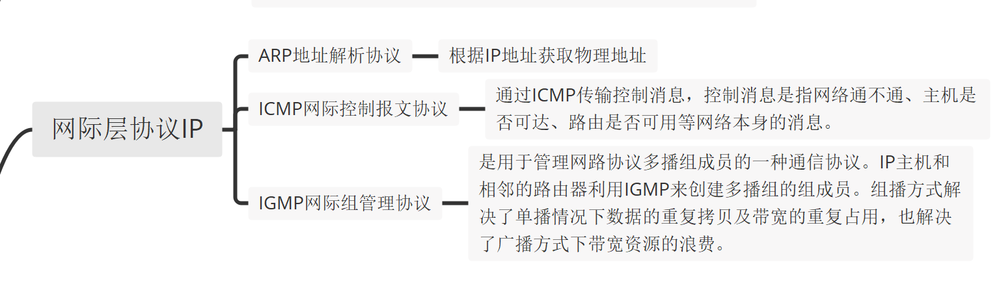
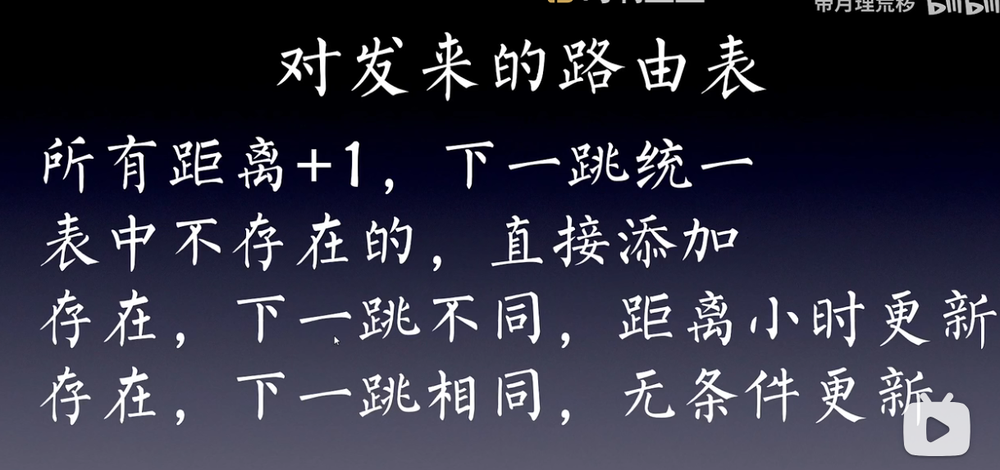

# 计算机网络考前学习

## 学习时间记录：

1. 11月30日 17：00-18：00，近1h
1. 12月1日 10：00-12：00，近2h,进度：看完速成课p1-p10
1. 12月1日 13：30-15：00，近1.5h,进度：看完速成课p11-p14
1. 12月1日 21：35-23：05，近1.5h,进度：看完了自己需要的网课部分
1. 12月3日 12：55-14：15，近80min,进度：看计算机网络大题速成课

## 计算机网络概念

## 计算机网络体系结构

### OSI参考模型

**OSI七层参考模型的作用：**

物理层：在连接各种计算机的传输媒体上传输数据比特流

数据链路层：实现相邻网络实体间的数据传输

网络层：将数据包跨越网络从源设备发送到目的设备（host to host）

传输层：将数据从源端口发送到目的端口（进程到进程）

会话层：在应用程序之间建立和维持会话，并能使会话获得同步

表示层：关注所传递信息的语法和语义，管理数据的表示方法，传输的数据结构

应用层：通过应用层协议，提供应用程序便捷的网络服务调用

**核心思想：下层为上层服务**

### TCP/IP参考模型

## 物理层的基本概念

#### 物理层四大特性

### 物理层的两种信号

### 调制与编码

### 传输介质

### 物理层相关的三大部分

### 物理层基本通信技术

#### 复用技术

#### 四种信道复用技术

#### 数据传输方式

##### 并行/串行传输

##### 同步/异步传输

##### 其他传输方式

## 数据链路层

### 数据链路层基础概论

数据链路层概念：数据链路层是在物理层和网络层之间的协议，提供相邻结点的可靠数据传输。

MAC地址：每一张网卡的48位**独一无二**的地址

帧

### 数据链路层的通信协议

#### 冲突域和广播域

#### 虚拟局域网

#### 其他

## 网络层

网络层的作用：提供点到点的服务

网际层协议IP

### IP地址

#### IP地址的组成

#### IP地址的分类

## 概念

网桥：一种桥接器，连接两个局域网的一种存储/转发设备。

## 重要图

### 子网划分：均分

### 子网划分：不均分

### 数据报分片

### 路由表更新

### 拥塞避免算法

